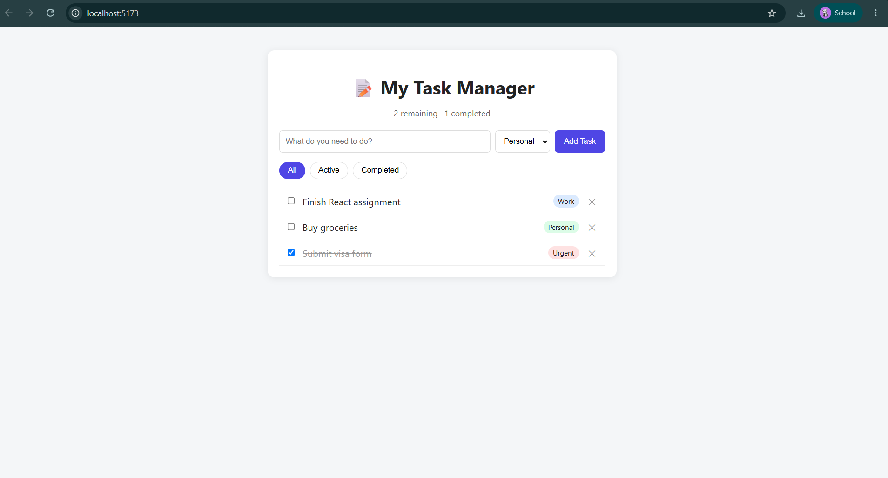

# 📝 My Task Manager

A personal task-management app built with React that lets users add, edit, complete, and organize their daily to-dos into categories, with all data saved automatically so it survives a page refresh.

## Features

- ✅ Add new tasks with a category (Work / Personal / Urgent)
- ✏️ Edit a task's text by double-clicking it
- ☑️ Mark tasks as complete/incomplete
- 🗑️ Delete tasks
- 🔎 Filter tasks by status: All / Active / Completed
- 🏷️ Organize tasks into categories with colored tags
- 💾 Tasks persist in `localStorage` — refreshing the page does not lose your data
- 🔢 Live count of remaining and completed tasks
- 📱 Responsive layout that works on both desktop and mobile screen widths

## Technologies Used

- [React](https://react.dev/) (functional components + hooks)
- [Vite](https://vitejs.dev/) — build tool and dev server
- Plain CSS (no external UI library)
- Browser `localStorage` API for persistence

## Project Structure

```
my-todo-app/
├── index.html
├── package.json
├── vite.config.js
└── src/
    ├── main.jsx
    ├── App.jsx              # main container, holds task state
    ├── App.css
    ├── index.css
    └── components/
        ├── TaskForm.jsx     # controlled form for adding a task
        ├── TaskList.jsx     # renders the list of tasks
        ├── TaskItem.jsx     # a single task row (view/edit/delete/toggle)
        └── FilterBar.jsx    # All / Active / Completed filter buttons
```

## Setup Instructions

1. Make sure [Node.js](https://nodejs.org/) is installed on your computer.
2. Download/clone this repository and open a terminal inside the project folder.
3. Install dependencies:
   ```
   npm install
   ```
4. Start the development server:
   ```
   npm run dev
   ```
5. Open the local address shown in the terminal (usually `http://localhost:5173`) in your browser.

## How to Use

- Type a task in the input box, choose a category, and click **Add Task**.
- Click the checkbox to mark a task complete/incomplete.
- **Double-click** a task's text to edit it, then press Enter or click away to save.
- Click the **✕** button to delete a task.
- Use the **All / Active / Completed** buttons to filter the list.

## Screenshots

   

   

   

## Known Limitations

- No due dates or drag-and-drop reordering (these were optional stretch goals, not implemented).
- No dark/light theme toggle.
- Category list is fixed (Work / Personal / Urgent) and not user-customizable.

## Author

Built as a course project ( Aryan Sah ) — React fundamentals assignment.
